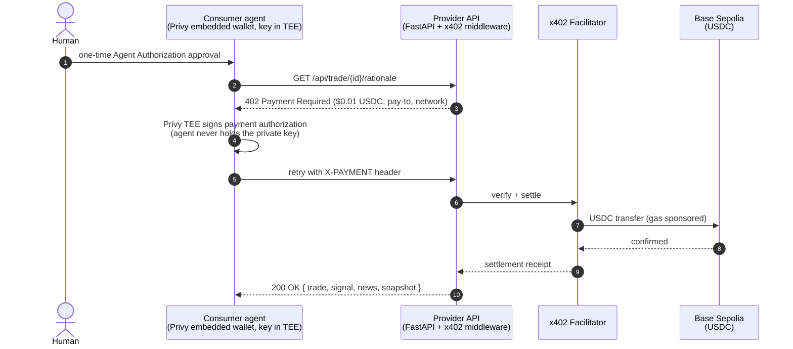

# SignalRelay

**Agent-to-agent prediction-market alpha, paid per call over x402 on Base.**

A Polymarket sentiment oracle that *earns* USDC by selling its Bayesian trading edge, and a
Privy-authorized consumer agent that *spends* USDC to hire it — one human approval, then
fully autonomous $0.01 micropayments. No API keys, no subscriptions.

Live payment verified on Base Sepolia: the consumer wallet is debited exactly $0.01 per
call and the paywalled rationale is returned over HTTP 200.

---

## Repository layout

| Path | What it is |
| --- | --- |
| `polymarket-sentiment-agent/backend` | FastAPI provider: agent loop (Scout → Quant → Oracle → Overseer → Trader), x402 paywall, Postgres/SQLite persistence |
| `polymarket-sentiment-agent/frontend` | React + Vite command center (dashboard, trade drawer, x402 lab) |
| `consumer/` | Privy Agent Authorization consumer (`@privy-io/node` + x402 client) |
| `chf/` | Quant research engine: data pipeline, leakage-safe features, vectorized backtests |
| `docs/` | Architecture, demo scripts, deployment notes, `PROJECT-NOTES.md` |

---

## The payment flow (x402 + Privy)



Unpaid callers get a deliberately truncated free teaser (`/api/demo/rationale/{id}`) — the
posterior, edge, source article, and market snapshot are only served on the paid route.
If `X402_ENABLED=true` and `X402_PAY_TO` is unset, the app **fails at startup** rather than
silently serving alpha for free.

## The signal itself

The LLM (Groq `llama-3.1-8b-instant`, with OpenAI → Anthropic → heuristic fallback) is used
**only as an NLP parser** — it extracts `{sentiment, confidence, topic, entities}` from a
headline. The probability math is deterministic Python: a Bayesian update of the
market-implied prior with a confidence-scaled likelihood ratio, clamped away from hard 0/1.

Verified live (2026-07-12), real Groq call on a Fed headline:
`sentiment=bullish, confidence=0.8, topic=FED` → `bayesian_update(prior=0.62)` →
`posterior=0.8727, likelihood_ratio=4.2`.

## Honest-data policy

Seeded demo rows are labeled `demo=true` end to end — database, API responses, and UI
(DEMO pills on trades, "includes DEMO data — PnL illustrative" on the portfolio and equity
panels). Nothing seeded is presented as live trading performance. Trading defaults to
PAPER mode; LIVE requires an explicit key and is off by default.

## chf — the research engine behind the quant claims

`chf/` is a standalone crypto-portfolio research pipeline (universe selection, market +
on-chain data QA, feature engineering, vectorized backtesting) built around research
integrity: point-in-time universes, leakage-audited features, deterministic seeds, and a
verifier stage that fails the pipeline on missing or malformed artifacts. Its
methodology is what disciplines the provider's Bayesian signal. See `chf/README.md`.

**Test status (honest counts, run 2026-07-12):**
- Backend app tier: **55 passed** (offline, in-memory SQLite).
- chf: **239 passed, 4 failed** of 243 — the 4 require pipeline-generated local data
  (`chf/data/raw/*`, gitignored) that does not exist in a fresh checkout; CI deselects
  exactly those 4 with the reason documented in `.github/workflows/ci.yml`.
- Frontend: `tsc --noEmit` clean, `vite build` green.

---

## Run it

### Provider (earns)
```bash
cd polymarket-sentiment-agent/backend
python3 -m venv .venv && source .venv/bin/activate
pip install -r requirements.txt
cp .env.example .env          # optional: GROQ_API_KEY, X402_ENABLED, X402_PAY_TO
uvicorn app.main:app --port 8000
# paywall check: curl -i http://localhost:8000/api/trade/1/rationale  -> 402 when enabled
```

### Frontend
```bash
cd polymarket-sentiment-agent/frontend
npm install && npm run dev    # http://localhost:5173
```

### Consumer (spends, Privy-authorized)
```bash
npx @privy-io/agent-wallet-cli login          # one-time human approval
npx localtunnel --port 8000                   # x402 client requires HTTPS
npx @privy-io/agent-wallet-cli fetch-x402 \
  --header "bypass-tunnel-reminder: 1" \
  https://<name>.loca.lt/api/trade/1/rationale
```
Node variant: [`consumer/consumer-agent.ts`](consumer/consumer-agent.ts).

### Tests
```bash
cd polymarket-sentiment-agent/backend && pytest tests -q   # 55 tests, fully offline
cd chf && pytest tests -q                                  # 239 offline + 4 data-dependent
```

## Deploy

Render blueprint at the repo root (`render.yaml`). Set `DATABASE_URL` (Postgres),
`CORS_ORIGINS` (your frontend origin only), and — to monetize — `X402_ENABLED=true` with a
real `X402_PAY_TO`. CI (`.github/workflows/ci.yml`) runs backend tests, chf tests, and the
frontend type-check + build on every push.

More: [`docs/PROJECT-NOTES.md`](docs/PROJECT-NOTES.md) ·
[`docs/ARCHITECTURE.md`](docs/ARCHITECTURE.md) · [`docs/DEMO_SCRIPT.md`](docs/DEMO_SCRIPT.md)
