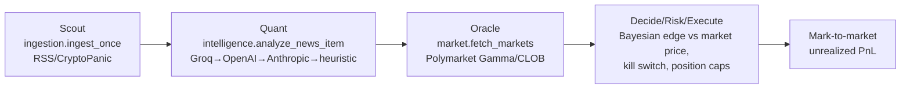
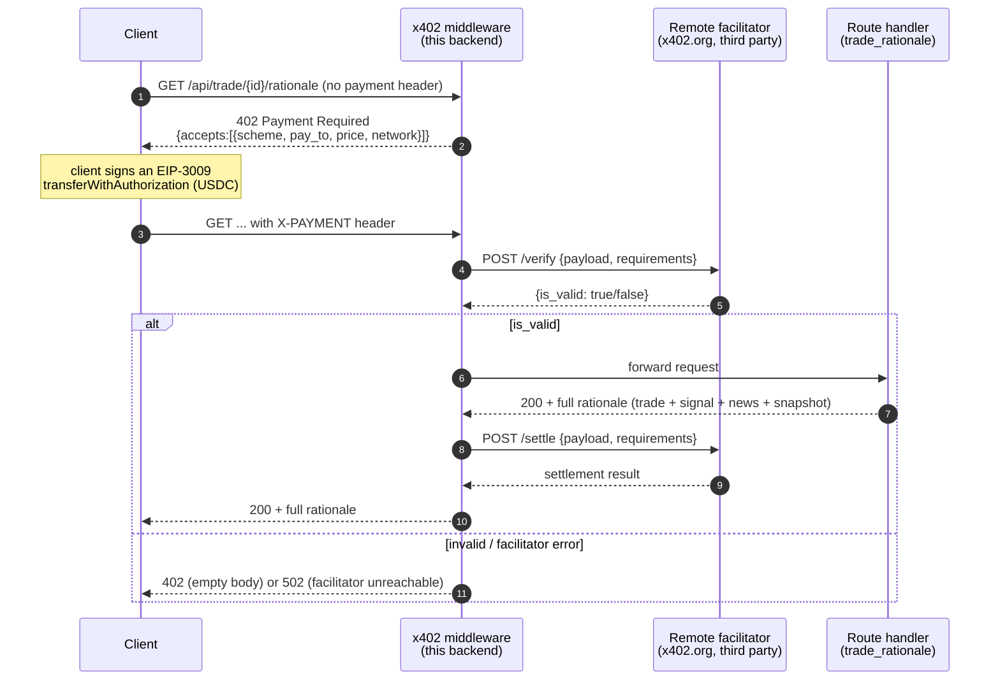
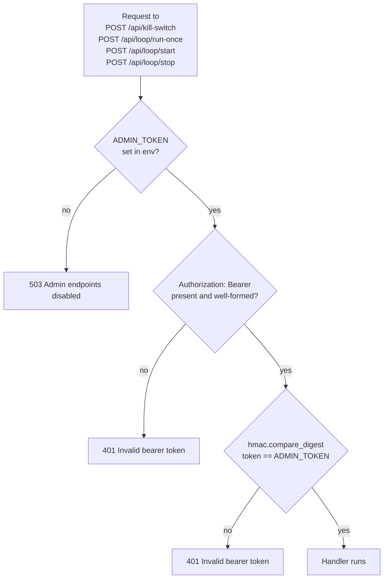

# SignalRelay — architecture

This repository currently holds **two independent systems** that do not talk to each other at
runtime, plus a small demo client:

1. **`chf/`** — a crypto quant research pipeline (universe → market data → on-chain data →
   features → labels → models → portfolio → backtest), run as a batch/scheduled data
   pipeline with its own FastAPI read API and Streamlit dashboard.
2. **`polymarket-sentiment-agent/`** — a FastAPI backend + React frontend that scouts news,
   scores sentiment with an LLM, runs a Bayesian trading loop against Polymarket markets, and
   sells the resulting trade rationale behind an x402 (HTTP 402) USDC paywall.
3. **`consumer/`** — a standalone Node/TypeScript script that plays the "buyer" role against
   the polymarket agent's paywalled endpoint, using a Privy embedded wallet.

Historically a fourth, unifying app (`alphanet-core/`) existed and merged `chf` and the
polymarket agent into one product. Per `docs/PROJECT-NOTES.md` it was **removed** from this
repo ("alphanet-core removed — the unrelated sub-app moved to its own repository"). What
remains is chf and the polymarket agent living side by side for pitch/demo convenience, with
no shared code, imports, ports, database, or env vars. See "The seam" below for the full
evidence trail — several docs in this repo still describe the old merged design and are
stale.

---

## Repository map

| Path | System | What it is |
|---|---|---|
| `chf/` | quant pipeline | Data pipeline, 9 pipeline agents, feature engineering, ML models, backtester, own FastAPI + Streamlit app |
| `chf/agents/` | quant pipeline | One agent class per pipeline stage (`AgentBase` lifecycle: `prepare → run → persist`) |
| `chf/providers/` | quant pipeline | 16 external data-source clients (market, on-chain, exchange) |
| `chf/features/` | quant pipeline | Pure feature-computation functions used by `FeatureAgent` |
| `chf/models/` | quant pipeline | Walk-forward CV (`walk_forward.py`) and market-vs-onchain ablation (`ablation.py`) |
| `chf/backtesting/`, `chf/portfolio/` | quant pipeline | Empty stub packages — all real logic lives in `agents/backtest_agent.py` / `agents/portfolio_agent.py` |
| `chf/pipelines/` | quant pipeline | `pipeline_runner.py` (stage orchestrator + inter-stage verify gates), `data_cleaner.py` (dead — see audit), `duckdb_engine.py` (mostly dead — see audit) |
| `chf/app/` | quant pipeline | `api.py` (FastAPI read API), `dashboard.py` (Streamlit, 6 pages incl. a Pipeline Control page) |
| `chf/jobs/scheduler.py` | quant pipeline | APScheduler cron jobs wrapping the pipeline stages |
| `chf/scripts/` | quant pipeline | Per-stage `verify_*_run.py` validators (shared by pipeline gates, `run_all.sh`, and pytest), plus bootstrap/smoke/readiness scripts |
| `chf/configs/` | quant pipeline | `run_config.yaml` (1494 lines, one section per stage + scale/demo variants), `universe_exclusions.yaml`, `config.py` loader |
| `chf/tests/` | quant pipeline | pytest suite, one file per agent + CLI/integration/demo tests |
| `chf/metadata/agent_registry.db` | quant pipeline | Gitignored local SQLite run-provenance log (not committed test data) |
| `chf/artifacts/` | quant pipeline | **Committed** (not gitignored) demo/legacy model artifacts — see audit finding on staleness |
| `polymarket-sentiment-agent/backend/app/` | sentiment agent | FastAPI app: orchestrator loop, x402 paywall, admin control endpoints, Groq/OpenAI/Anthropic sentiment, SQLAlchemy models |
| `polymarket-sentiment-agent/backend/tests/` | sentiment agent | 71 pytest tests, fully offline (mocked HTTP, temp SQLite) |
| `polymarket-sentiment-agent/frontend/src/` | sentiment agent | React 18 + Vite + Tailwind "Command Center" (3 routes: dashboard, x402 lab, pitch deck) |
| `consumer/` | demo client | Node/TS script: Privy wallet + `@x402/fetch` pays the polymarket agent's paywalled route |
| `render.yaml` | deploy | Deploys **only** `polymarket-sentiment-agent` (single Docker image, frontend built into the backend's static dir). `chf` is not deployed by Render. |
| `.github/workflows/ci.yml` | CI | Three independent jobs: `backend-tests` (polymarket), `chf-tests` (chf), `frontend-build` — no cross-job dependency |
| `docs/` | docs | This file + several **stale hackathon-era docs** describing the removed unified app (see "The seam") |

---

## chf/ — quant pipeline

### Pipeline stages

Nine agents (`chf/agents/*.py`), each subclassing `AgentBase` (`chf/agents/base.py`): a
`prepare() → run() → persist()` lifecycle, a deterministic `snapshot_id`
(`sha256(config_hash + data + run_id)`), and a row written to the local SQLite run registry
(`chf/metadata/agent_registry.db`) on every execution.

```mermaid
flowchart LR
    U[UniverseAgent] --> M[MarketDataAgent]
    M --> O[OnChainAgent]
    O -.-> C["clean stage\n(data_cleaner.py — broken/no-op,\nskipped by run_all.sh)"]
    O --> F[FeatureAgent]
    F --> L[LabelAgent]
    L --> MO[ModelAgent]
    MO --> P[PortfolioAgent]
    P --> B[BacktestAgent]

    AR[AlphaResearchAgent\n(manual research track,\nnot in the DAG)] -.->|export_alpha_candidates_for_backtest.py| P
    AR -.-> B

    classDef broken fill:#844,stroke:#a55,color:#fff;
    class C broken
```

The DAG runs through three different orchestration entry points (a real redundancy — see the
audit doc): `chf/main.py` (argparse CLI, the canonical one), `chf/pipelines/pipeline_runner.py`
(its own `main()`, gates every stage on the previous stage's verifier in-process), and
`chf/run_all.sh` (shell script, stage → verifier, and skips `clean`). `alpha_research` is a
separate signal-screening sweep, reachable only via `python main.py alpha_research`; it is
**structurally incapable of self-certifying alpha** — `_finalize_leaderboard` hardcodes
`final_alpha_status="failed"` on every row, and persistence raises if a row claims "passed"
without `backtest_source == "backtest_agent"`. Only `BacktestAgent` can certify alpha.

### Agents at a glance

| Agent | Responsibility | Key output |
|---|---|---|
| `UniverseAgent` | Monthly eligible-universe construction; excludes stablecoins/wrapped/bridged/LST/synthetic (`configs/universe_exclusions.yaml`), 365-day maturity, exchange tradability, on-chain coverage | `universe_monthly.parquet`, `universe_manifest.json` |
| `MarketDataAgent` | Daily OHLCV, exchange-first via ccxt (Coinbase/Kraken/KuCoin/Gemini), 4-provider close-only fallback. Hard-bans Binance and USDT-quoted pairs | `market_ohlcv.parquet`, per-symbol `by_symbol/*.parquet` |
| `OnChainAgent` | On-chain/DeFi fundamentals from 6 providers, aligned to each symbol's market calendar; deliberately does not forward-fill | `onchain_wide.parquet`, `onchain_observations.parquet` |
| `FeatureAgent` | Market + lagged on-chain features, cross-sectional winsorize/z-score, correlation + VIF pruning to 20–60 features | `full_features_pruned.parquet`, `feature_dictionary.json` |
| `LabelAgent` | Forward log-return labels at horizons [7, 14, 30]d, exact-calendar-horizon enforcement, prohibited-column leakage scan | `modeling_dataset.parquet`, `label_matrix.parquet` |
| `ModelAgent` | Baseline-mean / RandomForest / LightGBM across horizon × feature-set, purged + embargoed walk-forward CV, signal gate (rank-IC ≥ 0.01, t-stat ≥ 1.5, coverage ≥ 0.80, folds ≥ 3) | `model_predictions.parquet`, `model_leaderboard.parquet` |
| `PortfolioAgent` | Predictions → weights across 5 allocation strategies; blocks label-leaking inputs via `FORBIDDEN_INPUT_TERMS` | `allocations_from_predictions.parquet` |
| `BacktestAgent` | Allocations → performance vs 5 benchmarks, 20bps costs + cost sweep, strict multi-condition alpha gate | `alpha_report.json/.md`, `backtest_summary.parquet` |
| `AlphaResearchAgent` | Signal-screening sweep across feature sets × labels × horizons × 13 models (5 ML + rule-based) | `alpha_research_report.md` (never itself "passed") |

`chf/docs/agent_contracts.md` documents an earlier two-stage `FeatureAgentV1`/`V2` design and
per-symbol/per-model output files that no longer match the code — treat the agent source, not
that doc, as authoritative (see audit doc).

### Feature families (`chf/features/feature_engineering.py`)

Returns/momentum (`log_ret_*d`, `momentum_*`), risk (`realized_vol_*d`, skew, downside vol),
mean reversion (SMA gap, z-score, reversal), liquidity (dollar volume, volume ratio/z-score),
range/drawdown (ATR proxy, distance-from-high), BTC beta/correlation, lagged on-chain
levels/growth/ratios (NVT proxies, fees-to-TVL, issuance-to-mcap), and missingness/provenance
flags. A `PROHIBITED_COLUMN_TOKENS` denylist blocks obviously leaky column names from
propagating into the feature set.

### Config surface (chf)

| Surface | File | Notes |
|---|---|---|
| Pipeline/stage config | `chf/configs/run_config.yaml` (1494 lines) | One section per stage + many scale/demo variants (`market_data_10x365` … `75x1500`); contains a load-bearing **duplicate** `onchain:`/`on_chain:` section pair (see audit) |
| Universe exclusions | `chf/configs/universe_exclusions.yaml` | Denylist symbols + category keyword lists |
| Env vars | `.env` via `configs/config.py` | `CHF_SEED`, `LOG_LEVEL`, `MLFLOW_TRACKING_URI` (MLflow is configured but not wired into any agent — see audit), provider API keys: `CMC_API_KEY` (required for CMC modes), `COINGECKO_API_KEY` (optional), `ETHERSCAN_API_KEY`, `GRAPH_API_KEY`, `DUNE_API_KEY` |
| Provider toggles | `run_config.yaml` provider blocks | `thegraph` wired but `configured_subgraphs: {}` (inert); `blockchair`/`dune` wired but `enabled: false` |
| Config provenance | `get_config_hash()` | sha256 of the **entire** YAML, not just the stage subset a given run actually used — weakens per-stage provenance claims |

### App layer

- `chf/app/api.py` — FastAPI, CORS `allow_origins=["*"]`, no auth. `/health`, `/weights`,
  `/signals`, `/runs`, `/metrics`, `/latest_snapshot`. `/runs` and `/metrics` match current
  pipeline outputs; `/weights`, `/signals`, `/latest_snapshot` read legacy demo-generator
  filenames and are broken against real pipeline output (see audit).
- `chf/app/dashboard.py` — Streamlit, 6 pages. Universe Explorer and Backtest Analytics work
  against real data; Signal Monitor and Portfolio Weights have the same legacy-filename
  problem as the API. The Pipeline Control page fire-and-forget `subprocess.Popen`s pipeline
  stages with no auth and no concurrency lock (see audit).
- `chf/jobs/scheduler.py` — APScheduler `BlockingScheduler`: universe monthly, market daily,
  on-chain daily, features/clean/labels bundled daily, models monthly, portfolio weekly,
  backtest monthly. No `alpha_research` job.

### Test layout (chf)

```
cd signalrelay && .venv-chf/bin/python -m pytest chf/tests -q
→ 3 failed, 240 passed, 3428 warnings in 166.89s   (240 + 3 = 243)
```

14 test files, one research-mode suite per agent plus CLI/integration/demo/CMC-provider
suites, run fully offline against `chf/tests/fixtures/` (`live_api_enabled=False`,
`use_fixtures=True`).

The 3 known failures, root-caused:

| Test | Cause |
|---|---|
| `test_cli_commands.py::test_cmd_features_runs_both_feature_stages` | Monkeypatches `FeatureAgentV1`/`V2`, but `main.py` calls the unified `FeatureAgent` directly — the patch is a no-op. Test frozen at the pre-refactor two-stage feature design. |
| `test_market_data_agent_research_mode.py::test_verifier_does_not_falsely_fail_on_valid_10x365_output` | Asserts against the **real**, gitignored `chf/data/raw/market/` directory, which is empty in a fresh checkout — an environment-dependent (non-hermetic) test, not a code bug. |
| `test_pipeline_integration.py::test_pipeline_agents_run_end_to_end_from_market_data` | Calls `FeatureAgentV1`/`V2` as separate stages and expects legacy per-model prediction filenames — frozen at the pre-refactor architecture. |

All three trace back to one event: a refactor from `FeatureAgentV1`/`V2` + per-symbol/per-model
output files to unified agents + canonical single files that was completed in the agent code
but never fully propagated to docs, the app layer, `ablation.py`, `duckdb_engine.py`,
`smoke_test.py`, and these 2-3 tests. See `docs/CODE-AUDIT.md` finding #1.

---

## polymarket-sentiment-agent/ — x402 sentiment trading agent

### Component overview

FastAPI backend (`backend/app/`) + React frontend (`frontend/src/`), single Docker image in
production (`render.yaml`), SQLite by default (Postgres via `DATABASE_URL`). Background
`asyncio` loop runs Scout → Quant → Oracle → Risk → Trader every `LOOP_INTERVAL_SECONDS`
(default 30s), each stage wrapped in its own try/except so one stage's failure never kills the
loop:



The Bayesian math (`bayesian_update`, deterministic log-odds update, likelihood ratio capped
~5x) is explicitly separate from the LLM: the LLM only labels sentiment/confidence as strict
JSON and is instructed not to predict prices or recommend trades — the math is pure Python.

### x402 paywall — request flow (teaser vs. paid)

`GET /api/trade/{id}/rationale` is paywalled at `$0.01` USDC on Base Sepolia via the
`x402` pip package (`PaymentMiddlewareASGI`), configured in `app/x402_setup.py`.
`GET /api/demo/rationale/{id}` is the free, non-gated teaser of the same data.



Free teaser path (`/api/demo/rationale/{id}`, no middleware): returns
`trade.{id, market_question, outcome, side, mode}` plus the rationale text truncated to 80
chars — `news`, `snapshot`, and the full `signal` object (posterior, edge, confidence) are
withheld entirely.

**Important honesty note**: this backend performs **no local cryptographic verification** of
the payment. The `verify` and `settle` steps are both a plain HTTP POST to the configured
facilitator (`https://x402.org/facilitator` by default — a free, third-party-operated Base
Sepolia facilitator), and the backend trusts whatever `is_valid` the facilitator returns. This
is how the x402 spec is designed to work (resource server delegates to a facilitator), and the
failure mode is fail-closed (402/502 on facilitator error), but it means paywall security is
entirely a function of trusting that third-party service. See `docs/CODE-AUDIT.md` finding #2.

### Control-plane auth



Comparison is explicitly constant-time (`hmac.compare_digest`) to avoid a timing side-channel.
No endpoint exposes secrets. All other routes (`/api/news`, `/api/signals`, `/api/markets`,
`/api/trades`, `/api/portfolio`, `/api/logs`, `/api/equity-curve`, `/api/status`,
`/api/public/ping`) are intentionally open/unauthenticated read-only dashboard data.

### Config surface (polymarket-sentiment-agent/backend)

| Category | Vars |
|---|---|
| Runtime | `LOG_LEVEL`, `DATABASE_URL` (default `sqlite:///./data/doa.db` — README states a stale `sqlite:///./doa.db`), `HOST`, `PORT`, `CORS_ORIGINS`, `LOOP_INTERVAL_SECONDS` |
| Risk/trading | `EDGE_THRESHOLD`, `MIN_SIGNAL_CONFIDENCE`, `MAX_USDC_PER_TRADE`, `MAX_OPEN_POSITIONS`, `DAILY_DRAWDOWN_USDC`, `KILL_SWITCH`, `TRADING_MODE` (paper/live; live path raises `NotImplementedError` unconditionally — a deliberate safety stub), `WALLET_PRIVATE_KEY` (loaded but never used — inert), `POLYGON_RPC_URL` |
| Control plane | `ADMIN_TOKEN` (empty by default → admin routes 503) |
| Sentiment sources | `RSS_FEEDS`, `CRYPTOPANIC_API_KEY` |
| LLM providers | `GROQ_API_KEY`, `GROQ_MODEL` (default `llama-3.1-8b-instant`), `OPENAI_API_KEY`, `OPENAI_MODEL`, `ANTHROPIC_API_KEY`, `ANTHROPIC_MODEL` — first configured key wins, falls through to a heuristic keyword scorer if all fail/unset |
| Market watch | `WATCH_MARKETS`, `MARKET_KEYWORDS`, `MAX_MARKETS` |
| x402 | `X402_ENABLED`, `X402_PAY_TO` (validated hard at startup — no silent fallback to a zero/missing address), `X402_PRICE`, `X402_FACILITATOR_URL`, `X402_NETWORK` |
| Deploy-only (not a `Settings` field) | `FRONTEND_DIST` — read directly via `os.environ` in `main.py` to locate the built SPA |

### Test layout (polymarket-sentiment-agent/backend)

```
cd signalrelay && .venv-backend/bin/python -m pytest polymarket-sentiment-agent/backend/tests -q
→ 71 passed, 19 warnings in 3.24s   (0 failed, 0 skipped)
```

| File | Count | Covers |
|---|---|---|
| `test_admin_auth.py` | 16 | Bearer-token gating on the 4 admin endpoints (disabled/missing/wrong/correct token) |
| `test_paywall.py` | 12 | `X402_PAY_TO` validation, 402 gating, teaser-vs-paid field diffing |
| `test_intelligence_parsing.py` | 12 | `_safe_json`/`_normalize`/`_heuristic` — pure unit, no network |
| `test_bayesian.py` | 10 | Deterministic Bayes-update math |
| `test_api_routes.py` | 8 | Route-level integration against a seeded offline SQLite DB |
| `test_market_parsing.py` | 7 | Polymarket Gamma/CLOB parsing via `httpx.MockTransport` |
| `test_cors.py` | 6 | CORS allowlist behavior |

16 = `test_admin_auth.py`; 55 = the sum of the other six files — this is where the brief's
"55+16" comes from. `conftest.py` forces a throwaway tmp SQLite DB and `X402_ENABLED=false`
before app import; no test hits a real network endpoint or the real facilitator.
`seed_demo.py`/`seed_history.py` are standalone demo-data scripts, not imported by any
production code path (only used directly or via a pytest fixture).

### Frontend (`polymarket-sentiment-agent/frontend/src`)

React 18 + Vite 5 + Tailwind 3 + `react-router-dom` + `recharts`. Three routes: `/`
(Dashboard/"Command Center" — portfolio stats, equity chart, trade log, signals feed, news
stream, kill-switch toggle, "run one cycle" button, polls every 5s), `/x402-lab` (a staged
animation of the 402→sign→settle→200 flow — two of five steps hit the real backend, the rest
are `sleep()`s for pacing), `/pitch` (static slide deck). No admin-token-gated UI exists in the
frontend even though the backend has admin routes. All API calls are relative paths (no base
URL config), relying on same-origin serving or Vite's dev proxy — fine for the single-service
Render deploy, would need a base-URL config to split frontend/backend across origins.

### consumer/ — demo paying client

`consumer/consumer-agent.ts`: Node/TS script using `@privy-io/node` (embedded/TEE wallet) +
`@x402/fetch`'s `wrapFetchWithPayment` to GET the polymarket agent's paywalled rationale route,
letting the wrapper transparently handle 402 → sign → retry → 200. Defaults
`PROVIDER_URL=http://localhost:8000` (the polymarket backend). Standalone — not wired into CI,
not imported by either backend, no reference to `chf` anywhere in the file.

---

## The seam: how (and whether) chf and the polymarket agent connect

**Verdict: they don't, at the code level.** Evidence:

- `grep -rn "polymarket\|sentiment" chf --include=*.py --include=*.md` → only two incidental
  hits, both stating that social/sentiment features are *not implemented* in chf
  (`chf/docs/current_codebase_status.md`, `chf/docs/agentic_ai_suggestions.md`).
- `grep -rln "chf" polymarket-sentiment-agent` (excluding `node_modules`) → **zero files**.
- No `docker-compose.yml` anywhere in the repo linking the two services.
- `render.yaml` deploys only `polymarket-sentiment-agent`; chf is not deployed by Render at
  all and has no shared env vars with the deployed service.
- Ports don't overlap by design or accident: chf's optional API/dashboard default to `:8000`
  (API, only if run) and `:8501` (Streamlit); the polymarket backend also defaults to `:8000`
  — coincidental framework defaults, not a shared/dialed port, since chf's API is never run in
  the deployed configuration.

The *current*, accurate docs (`README.md`, `SUBMISSION.md`, `DEMO_SCRIPT.md`, `PITCH_SCRIPT.md`,
`docs/PROJECT-NOTES.md`) only make a soft, non-code claim: chf's leakage-safe methodology is
cited as the intellectual precedent for the polymarket agent's Bayesian rigor, and
`SUBMISSION.md`'s own "built today vs. pre-existing" table labels chf as **"pre-existing
(referenced)"** — never claimed as code-integrated.

Several **stale** docs describe a stronger, since-abandoned integration and should not be
trusted as current: `docs/ARCHITECTURE_BLUEPRINT.md` ("AlphaNet-402 merges deterministic quant
research (from Project CHF) with live Bayesian trading logic... unified application code lives
under `/alphanet-core`"), `docs/HACKATHON_CONCEPT.md` ("How the Repositories Merge"),
`CURSOR_DOCS.md`, `docs/DEMO_GUIDE.md`, `docs/PITCH_DECK_PRESENT.md`,
`docs/DEPLOYMENT_AZURE_DO_DIGITALOCEAN_SENTRY.md`, `docs/AWAL_WALLET_SETUP.md`, and the
previous version of this file (`docs/ARCHITECTURE.md`, "AlphaNet-402" Scout/Quant/Risk/Command
Center narrative with Tavily + AWAL). `docs/PROJECT-NOTES.md` confirms the unifying
`alphanet-core/` app was built at some point and then explicitly removed from this repo. Treat
those documents as historical, not authoritative, until/unless someone deletes or rewrites
them.

**Bottom line for a reviewer**: this repo currently bundles two unrelated products — a crypto
quant research pipeline and an x402/Privy micropayment paywall demo — with zero runtime
integration. Any pitch language implying they are one system describes a past or aspirational
state, not the current code.
